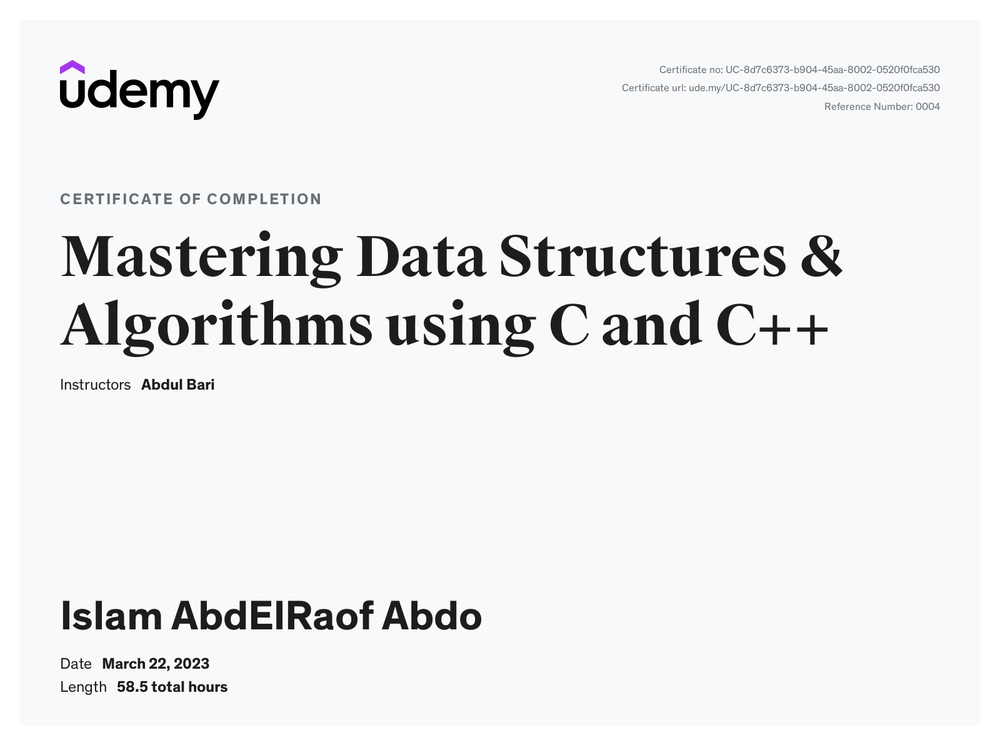

# Mastering Data Structures & Algorithms Using C and C++
This repository contains the solved code from the [Mastering Data Structures & Algorithms Using C and C++](https://www.udemy.com/course/datastructurescncpp/) course by Abdul Bari on Udemy.

## Course Overview
The course covers a wide range of data structures and algorithms topics, including:

- Arrays and linked lists
- Stacks and Queues
- Trees (including Binary Search Trees and AVL Trees)
- Hashing and Graphs
- Searching and Sorting Algorithms
- And more!

Each section of the course includes theory lectures, as well as practical examples and exercises to help you apply the concepts you've learned.

## Repository Structure
The repository is organized by section, with each section containing subdirectories for each topic covered in that section. Within each topic directory, you'll find the solved code for the exercises and examples covered in the course.

## Certifications
I have successfully completed the Mastering Data Structures & Algorithms Using C and C++ course on Udemy and earned the following certifications:

[Certificate of Completion](https://www.udemy.com/certificate/UC-8d7c6373-b904-45aa-8002-0520f0fca530/)

Please feel free to contact me if you have any questions or concerns about the code in this repository or my certifications.

Thank you for checking out my repository!